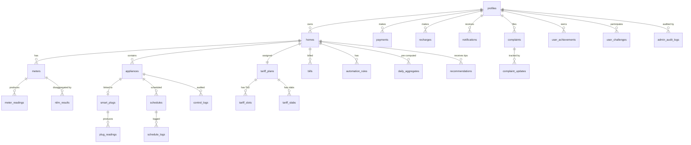

# VoltWise — Database Schema (Supabase PostgreSQL)

> **⚠️ TEAM REFERENCE — DO NOT EDIT CASUALLY**
> This is the single source of truth for all database tables.
> Any column changes HERE must be reflected in `api_endpoints.md` and frontend `types.ts`.
> Last updated: 2026-02-20 v2

---

## Schema Overview (30 tables)



---

## Enums

```sql
-- Run these BEFORE creating tables

CREATE TYPE user_role        AS ENUM ('consumer', 'admin', 'super_admin');
CREATE TYPE meter_type       AS ENUM ('prepaid', 'postpaid');
CREATE TYPE tariff_category  AS ENUM ('residential', 'commercial', 'industrial', 'agricultural');
CREATE TYPE appliance_status AS ENUM ('ON', 'OFF', 'SCHEDULED', 'WARNING');
CREATE TYPE appliance_source AS ENUM ('nilm', 'smart_plug', 'manual');
CREATE TYPE plug_status      AS ENUM ('online', 'offline', 'pairing');
CREATE TYPE schedule_repeat  AS ENUM ('once', 'daily', 'weekdays', 'weekends', 'custom');
CREATE TYPE bill_status      AS ENUM ('generated', 'paid', 'overdue', 'partial');
CREATE TYPE payment_method   AS ENUM ('upi', 'debit_card', 'credit_card', 'net_banking', 'wallet');
CREATE TYPE payment_status   AS ENUM ('success', 'failed', 'pending', 'refunded');
CREATE TYPE notif_type       AS ENUM ('peak', 'budget', 'schedule', 'tip', 'system', 'outage', 'payment', 'recharge', 'complaint');
CREATE TYPE complaint_type   AS ENUM ('billing', 'outage', 'meter_error', 'payment', 'service', 'other');
CREATE TYPE complaint_status AS ENUM ('received', 'in_progress', 'assigned', 'resolved', 'closed');
CREATE TYPE slot_type        AS ENUM ('off-peak', 'normal', 'peak');
CREATE TYPE recommendation_type AS ENUM ('schedule_shift', 'usage_reduction', 'general_tip');
```

---

## Table Creation Order

> [!IMPORTANT]
> Due to foreign key dependencies, create tables in this exact order:
> 1. `profiles` → 2. `tariff_plans` → 3. `tariff_slots` → 4. `tariff_slabs`
> → 5. `homes` (references tariff_plans, so plans must exist first)
> → 6. `meters` → 7. `smart_plugs` → 8. `appliances` (references smart_plugs, so plugs first)
> → 9. `meter_readings` → 10. `plug_readings` → 11. `nilm_results`
> → 12. `daily_aggregates` → 13. `schedules` → 14. `schedule_logs`
> → 15. `control_logs` → 16. `automation_rules` → 17. `recommendations`
> → 18. `bills` → 19. `payments` → 20. `recharges`
> → 21. `notifications` → 22. `complaints` → 23. `complaint_updates`
> → 24. `achievements` → 25. `user_achievements` → 26. `challenges`
> → 27. `user_challenges` → 28. `carbon_stats` → 29. `outage_notices`
> → 30. `admin_audit_logs`

---

## 1. profiles

Extends Supabase `auth.users`. Created via trigger on signup.

```sql
CREATE TABLE profiles (
    id              UUID PRIMARY KEY REFERENCES auth.users(id) ON DELETE CASCADE,
    role            user_role       NOT NULL DEFAULT 'consumer',
    name            TEXT            NOT NULL,
    phone           TEXT,
    consumer_number TEXT            UNIQUE,          -- DISCOM consumer ID
    avatar_url      TEXT,
    location        TEXT,                            -- "Bangalore, KA"
    household_members INT          DEFAULT 1,
    onboarding_done BOOLEAN        DEFAULT FALSE,
    created_at      TIMESTAMPTZ    DEFAULT now(),
    updated_at      TIMESTAMPTZ    DEFAULT now()
);

-- Frontend mapping → AuthContext.User
-- id            → user.id
-- name          → user.name
-- auth.users.email → user.email
-- location      → user.location
-- (tariffPlan comes from homes.tariff_plan_id → tariff_plans.name)
-- household_members → user.householdMembers
-- initials computed on frontend from name
```

**Signup trigger** — creates profile row automatically when a user signs up:

```sql
CREATE OR REPLACE FUNCTION handle_new_user()
RETURNS TRIGGER AS $$
BEGIN
  INSERT INTO public.profiles (id, name, phone, consumer_number, role)
  VALUES (
    NEW.id,
    COALESCE(NEW.raw_user_meta_data->>'name', ''),
    NEW.raw_user_meta_data->>'phone',
    NEW.raw_user_meta_data->>'consumer_number',
    'consumer'
  );
  RETURN NEW;
END;
$$ LANGUAGE plpgsql SECURITY DEFINER;

CREATE TRIGGER on_auth_user_created
  AFTER INSERT ON auth.users
  FOR EACH ROW EXECUTE FUNCTION handle_new_user();
```

---

## 2. homes

A user can link multiple meters/homes.

```sql
CREATE TABLE homes (
    id              UUID PRIMARY KEY DEFAULT gen_random_uuid(),
    user_id         UUID NOT NULL REFERENCES profiles(id) ON DELETE CASCADE,
    name            TEXT NOT NULL DEFAULT 'My Home',
    address         TEXT,
    city            TEXT,
    state           TEXT,
    pincode         TEXT,
    feeder_id       TEXT,                                     -- DISCOM feeder reference
    area            TEXT,                                     -- locality / zone
    tariff_category tariff_category DEFAULT 'residential',
    tariff_plan_id  UUID REFERENCES tariff_plans(id),
    sanctioned_load_kw NUMERIC(5,2) DEFAULT 5.0,             -- DISCOM-approved max load in kW
    is_primary      BOOLEAN DEFAULT TRUE,
    created_at      TIMESTAMPTZ DEFAULT now(),
    updated_at      TIMESTAMPTZ DEFAULT now()
);
```

> [!NOTE]
> `sanctioned_load_kw` is needed for billing: `tariff_slabs.fixed_charge_per_kw × sanctioned_load_kw`.
> Typical residential values: 3-10 kW. Set during signup or admin assignment.

---

## 3. meters

Smart meters linked to a home.

```sql
CREATE TABLE meters (
    id              UUID PRIMARY KEY DEFAULT gen_random_uuid(),
    home_id         UUID NOT NULL REFERENCES homes(id) ON DELETE CASCADE,
    meter_number    TEXT NOT NULL UNIQUE,              -- Physical meter serial
    meter_type      meter_type DEFAULT 'prepaid',
    manufacturer    TEXT,
    installation_date DATE,
    is_active       BOOLEAN DEFAULT TRUE,
    last_reading_at TIMESTAMPTZ,
    -- Prepaid balance fields
    balance_amount  NUMERIC(10,2) DEFAULT 0,          -- ₹ remaining
    last_recharge_amount NUMERIC(10,2) DEFAULT 0,
    last_recharge_date   TIMESTAMPTZ,
    created_at      TIMESTAMPTZ DEFAULT now(),
    updated_at      TIMESTAMPTZ DEFAULT now()
);

-- Frontend mapping → DASHBOARD_STATS
-- balance_amount        → balance (₹550)
-- last_recharge_amount  → lastRechargeAmount (₹2000)
-- last_recharge_date    → lastRechargeDate
-- balancePercent computed: (balance_amount / last_recharge_amount) * 100
```

---

## 4. meter_readings

Time-series data from smart meters. **High-volume table.**

```sql
CREATE TABLE meter_readings (
    id              UUID PRIMARY KEY DEFAULT gen_random_uuid(),
    meter_id        UUID NOT NULL REFERENCES meters(id) ON DELETE CASCADE,
    timestamp       TIMESTAMPTZ NOT NULL DEFAULT now(),
    kwh_reading     NUMERIC(12,4),                    -- Cumulative kWh
    kwh_delta       NUMERIC(10,4),                    -- kWh since last reading
    power_kw        NUMERIC(8,3),                     -- Instantaneous load in kW
    voltage         NUMERIC(6,2),
    current_amps    NUMERIC(6,2),
    power_factor    NUMERIC(4,3),
    cost_delta      NUMERIC(10,2),                    -- Cost of kwh_delta at current tariff
    tariff_rate     NUMERIC(6,2),                     -- ₹/kWh rate at this timestamp
    created_at      TIMESTAMPTZ DEFAULT now()
);

CREATE INDEX idx_meter_readings_meter_ts ON meter_readings(meter_id, timestamp DESC);
CREATE INDEX idx_meter_readings_ts       ON meter_readings(timestamp DESC);

-- Frontend mapping → DASHBOARD_STATS
-- Latest power_kw    → currentLoad (1.8 kW)
-- SUM(kwh_delta) today → todayKwh (12.5)
-- SUM(cost_delta) today → todayCost (₹78.50)
-- tariff_rate (latest) → currentTariff (₹6.50)
```

> [!TIP]
> Consider Supabase partitioning by month or using TimescaleDB extension for millions of readings.

---

## 5. appliances

Appliances in a home — discovered by NILM, added via smart plug, or manually.

```sql
CREATE TABLE appliances (
    id              UUID PRIMARY KEY DEFAULT gen_random_uuid(),
    home_id         UUID NOT NULL REFERENCES homes(id) ON DELETE CASCADE,
    name            TEXT NOT NULL,                     -- "AC - Living Room"
    icon            TEXT NOT NULL DEFAULT 'zap',       -- Lucide icon name
    source          appliance_source DEFAULT 'manual', -- How it was added
    rated_power_w   INT,                               -- Rated wattage
    current_power_w NUMERIC(8,2) DEFAULT 0,            -- Live wattage (from plug or NILM)
    status          appliance_status DEFAULT 'OFF',
    cost_per_hour   NUMERIC(8,2) DEFAULT 0,            -- Computed: power × tariff
    runtime_today   TEXT,                              -- "2h 15m" (computed)
    schedule_time   TEXT,                              -- "Tonight 11 PM" (if scheduled)
    message         TEXT,                              -- Smart tip: "Peak Hour! +₹3.20/hr"
    saving_potential NUMERIC(6,2),                     -- % savings if shifted
    smart_plug_id   UUID REFERENCES smart_plugs(id),  -- NULL if NILM-only or manual
    is_active       BOOLEAN DEFAULT TRUE,
    sort_order      INT DEFAULT 0,
    created_at      TIMESTAMPTZ DEFAULT now(),
    updated_at      TIMESTAMPTZ DEFAULT now()
);

-- Frontend mapping → types.ts Appliance
-- id             → id (UUID, frontend casts to string)
-- name           → name
-- icon           → icon
-- status         → status (enum matches exactly)
-- current_power_w → power (in Watts)
-- cost_per_hour  → costPerHour
-- runtime_today  → runtime
-- schedule_time  → scheduleTime
-- message        → message
-- saving_potential → savingPotential
```

> [!WARNING]
> **Insert order**: `smart_plugs` must be created BEFORE `appliances` rows that reference them.
> The `smart_plug_id` FK is nullable, so appliances without plugs (NILM-only, manual) can be
> inserted freely. When pairing a plug, insert into `smart_plugs` first, then update
> `appliances.smart_plug_id`.

---

## 6. smart_plugs

Tuya smart plugs registered to the system.

```sql
CREATE TABLE smart_plugs (
    id              UUID PRIMARY KEY DEFAULT gen_random_uuid(),
    home_id         UUID NOT NULL REFERENCES homes(id) ON DELETE CASCADE,
    tuya_device_id  TEXT NOT NULL UNIQUE,              -- Tuya cloud device ID
    name            TEXT,                              -- User-given name
    plug_status     plug_status DEFAULT 'offline',
    ip_address      TEXT,
    firmware_version TEXT,
    wifi_ssid       TEXT,
    signal_strength INT,                               -- dBm
    last_seen_at    TIMESTAMPTZ,
    calibration_done BOOLEAN DEFAULT FALSE,
    created_at      TIMESTAMPTZ DEFAULT now(),
    updated_at      TIMESTAMPTZ DEFAULT now()
);
```

---

## 7. plug_readings

Power data from Tuya smart plugs. Separate from meter_readings.

```sql
CREATE TABLE plug_readings (
    id              UUID PRIMARY KEY DEFAULT gen_random_uuid(),
    plug_id         UUID NOT NULL REFERENCES smart_plugs(id) ON DELETE CASCADE,
    appliance_id    UUID REFERENCES appliances(id),
    timestamp       TIMESTAMPTZ NOT NULL DEFAULT now(),
    power_w         NUMERIC(8,2),                     -- Watts
    voltage         NUMERIC(6,2),
    current_ma      NUMERIC(8,2),                     -- milliAmps
    energy_kwh      NUMERIC(10,4),                    -- Cumulative
    is_on           BOOLEAN DEFAULT FALSE,
    created_at      TIMESTAMPTZ DEFAULT now()
);

CREATE INDEX idx_plug_readings_plug_ts ON plug_readings(plug_id, timestamp DESC);
```

---

## 8. nilm_results

NILM disaggregation output per meter reading window.

```sql
CREATE TABLE nilm_results (
    id              UUID PRIMARY KEY DEFAULT gen_random_uuid(),
    meter_id        UUID NOT NULL REFERENCES meters(id) ON DELETE CASCADE,
    window_start    TIMESTAMPTZ NOT NULL,
    window_end      TIMESTAMPTZ NOT NULL,
    appliance_name  TEXT NOT NULL,                     -- "AC", "Geyser", "Fridge"
    estimated_kwh   NUMERIC(10,4),
    estimated_power_w NUMERIC(8,2),
    confidence      NUMERIC(4,3),                     -- 0.000 – 1.000
    created_at      TIMESTAMPTZ DEFAULT now()
);

-- Frontend mapping → CHART_DATA_DONUT
-- appliance_name → name ("AC")
-- estimated_kwh percent → value (45)
-- fill color chosen by frontend from appliance icon mapping
```

---

## 9. tariff_plans

Tariff structures configured by admin.

```sql
CREATE TABLE tariff_plans (
    id              UUID PRIMARY KEY DEFAULT gen_random_uuid(),
    name            TEXT NOT NULL,                     -- "ToD (Peak/Off)"
    discom          TEXT,                              -- "BESCOM", "UPPCL"
    category        tariff_category DEFAULT 'residential',
    is_active       BOOLEAN DEFAULT TRUE,
    effective_from  DATE NOT NULL,
    effective_to    DATE,
    created_at      TIMESTAMPTZ DEFAULT now(),
    updated_at      TIMESTAMPTZ DEFAULT now()
);
```

---

## 10. tariff_slots (Time-of-Day)

ToD multiplier/rate for different hours of day.

```sql
CREATE TABLE tariff_slots (
    id              UUID PRIMARY KEY DEFAULT gen_random_uuid(),
    plan_id         UUID NOT NULL REFERENCES tariff_plans(id) ON DELETE CASCADE,
    hour_label      TEXT NOT NULL,                     -- "12AM", "2AM", "8AM"
    start_hour      INT NOT NULL,                      -- 0-23
    end_hour        INT NOT NULL,                      -- 0-23
    rate            NUMERIC(6,2) NOT NULL,             -- ₹/kWh
    slot_type       slot_type NOT NULL,                -- 'off-peak','normal','peak'
    created_at      TIMESTAMPTZ DEFAULT now()
);

-- Frontend mapping → TARIFF_RATES
-- hour_label → hour ("12AM")
-- rate       → rate (4)
-- slot_type  → type ("off-peak")
```

---

## 11. tariff_slabs (Consumption Slabs) ⚡ NEW

Indian tariffs use **telescopic consumption slabs** (0-100 kWh at ₹3, 101-200 at ₹4.50, etc.).
The billing engine applies slabs first for the base rate, then multiplies by ToD factor from `tariff_slots`.

```sql
CREATE TABLE tariff_slabs (
    id                  UUID PRIMARY KEY DEFAULT gen_random_uuid(),
    plan_id             UUID NOT NULL REFERENCES tariff_plans(id) ON DELETE CASCADE,
    from_kwh            INT NOT NULL,              -- 0
    to_kwh              INT,                       -- NULL = unlimited (last slab)
    rate_per_kwh        NUMERIC(6,2) NOT NULL,     -- ₹3.00
    fixed_charge_per_kw NUMERIC(6,2) DEFAULT 0,    -- Fixed charge component
    display_order       INT DEFAULT 0,
    created_at          TIMESTAMPTZ DEFAULT now()
);

-- Example data for BESCOM Residential:
-- (plan_id, 0,   100, 3.75, 0, 1)
-- (plan_id, 101, 200, 5.20, 0, 2)
-- (plan_id, 201, 500, 7.10, 0, 3)
-- (plan_id, 501, NULL, 8.50, 0, 4)  ← NULL to_kwh = unlimited
```

> [!IMPORTANT]
> **Billing calculation flow:**
> 1. Apply telescopic slabs to total monthly kWh → base energy charge
> 2. Multiply each kWh by ToD factor from `tariff_slots` based on when it was consumed
> 3. Add fixed charges from `tariff_slabs.fixed_charge_per_kw × sanctioned_load`
> 4. Add taxes & surcharges → final bill

---

## 12. daily_aggregates ⚡ NEW

Pre-computed daily summaries to avoid scanning millions of `meter_readings` rows on every dashboard load.

```sql
CREATE TABLE daily_aggregates (
    id              BIGSERIAL PRIMARY KEY,
    home_id         UUID NOT NULL REFERENCES homes(id) ON DELETE CASCADE,
    meter_id        UUID REFERENCES meters(id),
    appliance_id    UUID REFERENCES appliances(id),  -- NULL = home total
    date            DATE NOT NULL,
    total_kwh       NUMERIC(10,4) NOT NULL,
    total_cost      NUMERIC(10,2) NOT NULL,
    peak_power_kw   NUMERIC(8,3),
    avg_power_kw    NUMERIC(8,3),
    on_hours        NUMERIC(5,2),
    carbon_kg       NUMERIC(8,3)
    -- NOTE: No table-level UNIQUE here — see functional index below
);

-- Functional unique index handles NULL appliance_id correctly
-- (PostgreSQL treats NULL ≠ NULL in regular UNIQUE constraints)
CREATE UNIQUE INDEX idx_daily_agg_unique
  ON daily_aggregates(home_id, COALESCE(appliance_id, '00000000-0000-0000-0000-000000000000'::uuid), date);
CREATE INDEX idx_daily_agg_home_date ON daily_aggregates(home_id, date DESC);
```

> [!TIP]
> FastAPI scheduler populates this nightly via cron. Dashboard/Insights queries `daily_aggregates`
> instead of `meter_readings`. Only the real-time gauge queries raw `meter_readings` (latest row only).

---

## 13. bills

Monthly billing records.

```sql
CREATE TABLE bills (
    id              UUID PRIMARY KEY DEFAULT gen_random_uuid(),
    home_id         UUID NOT NULL REFERENCES homes(id) ON DELETE CASCADE,
    meter_id        UUID REFERENCES meters(id),
    bill_month      DATE NOT NULL,                     -- First day of month
    total_kwh       NUMERIC(10,2),
    base_amount     NUMERIC(10,2),                     -- Energy charges (from slabs)
    tax_amount      NUMERIC(10,2),                     -- Taxes & surcharges
    surcharge_amount NUMERIC(10,2),
    total_amount    NUMERIC(10,2) NOT NULL,            -- Final bill
    savings_amount  NUMERIC(10,2) DEFAULT 0,           -- Savings vs avg
    previous_amount NUMERIC(10,2),                     -- Last month for comparison
    change_percent  NUMERIC(5,2),                      -- +/- % vs previous
    pdf_url         TEXT,                               -- Supabase Storage path
    status          bill_status DEFAULT 'generated',
    due_date        DATE,
    paid_at         TIMESTAMPTZ,
    created_at      TIMESTAMPTZ DEFAULT now()
);

-- Frontend mapping → BillHistory screen
-- bill_month      → month label
-- total_kwh       → kwh bar chart
-- total_amount    → ₹ amount
-- change_percent  → trend arrow
-- pdf_url         → download button
```

---

## 14. payments

Payment transactions (bill payments). Integrates with Razorpay.

```sql
CREATE TABLE payments (
    id              UUID PRIMARY KEY DEFAULT gen_random_uuid(),
    user_id         UUID NOT NULL REFERENCES profiles(id),
    bill_id         UUID REFERENCES bills(id),
    amount          NUMERIC(10,2) NOT NULL,
    method          payment_method NOT NULL,
    status          payment_status DEFAULT 'pending',
    transaction_id  TEXT,                               -- Gateway reference
    razorpay_order_id   TEXT,                           -- Razorpay order ID
    razorpay_payment_id TEXT,                           -- Razorpay payment ID
    razorpay_signature  TEXT,                           -- For verification
    gateway_response JSONB,                             -- Full gateway response
    paid_at         TIMESTAMPTZ,
    created_at      TIMESTAMPTZ DEFAULT now()
);
```

---

## 15. recharges

Prepaid meter recharges. Also goes through Razorpay.

```sql
CREATE TABLE recharges (
    id              UUID PRIMARY KEY DEFAULT gen_random_uuid(),
    user_id         UUID NOT NULL REFERENCES profiles(id),
    meter_id        UUID NOT NULL REFERENCES meters(id),
    amount          NUMERIC(10,2) NOT NULL,
    method          payment_method NOT NULL,
    status          payment_status DEFAULT 'pending',
    transaction_id  TEXT,
    razorpay_order_id   TEXT,
    razorpay_payment_id TEXT,
    razorpay_signature  TEXT,
    units_credited  NUMERIC(10,2),                     -- kWh added
    balance_after   NUMERIC(10,2),                     -- New balance
    paid_at         TIMESTAMPTZ,
    created_at      TIMESTAMPTZ DEFAULT now()
);

-- Frontend mapping → DASHBOARD_STATS
-- amount          → lastRechargeAmount
-- paid_at         → lastRechargeDate
-- balance_after   → balance
```

---

## 16. schedules

```sql
CREATE TABLE schedules (
    id              UUID PRIMARY KEY DEFAULT gen_random_uuid(),
    appliance_id    UUID NOT NULL REFERENCES appliances(id) ON DELETE CASCADE,
    home_id         UUID NOT NULL REFERENCES homes(id),
    start_time      TIME NOT NULL,                     -- 23:00
    end_time        TIME,                              -- 06:00 (optional)
    repeat_type     schedule_repeat DEFAULT 'once',
    custom_days     INT[],                             -- [1,2,3,4,5] for weekdays
    is_active       BOOLEAN DEFAULT TRUE,
    last_executed   TIMESTAMPTZ,
    created_by      TEXT DEFAULT 'user',               -- 'user' | 'ai_optimizer'
    created_at      TIMESTAMPTZ DEFAULT now(),
    updated_at      TIMESTAMPTZ DEFAULT now()
);
```

---

## 17. schedule_logs ⚡ NEW

Execution history for schedules. Records every attempt including failures.

```sql
CREATE TABLE schedule_logs (
    id              BIGSERIAL PRIMARY KEY,
    schedule_id     UUID REFERENCES schedules(id) ON DELETE SET NULL,
    appliance_id    UUID REFERENCES appliances(id),
    executed_at     TIMESTAMPTZ NOT NULL,
    action          TEXT NOT NULL,             -- 'ON' or 'OFF'
    result          TEXT NOT NULL,             -- 'success', 'failed', 'device_offline'
    error_message   TEXT,
    created_at      TIMESTAMPTZ DEFAULT now()
);

CREATE INDEX idx_schedule_logs_schedule ON schedule_logs(schedule_id, executed_at DESC);
```

> [!NOTE]
> When a schedule fires at 5:30 AM and the plug is offline, this table records
> `result='device_offline'` with `error_message='Tuya device eb1234 unreachable'`.
> The scheduler retries 3 times, each attempt logged.

---

## 18. control_logs ⚡ NEW

Audit trail for every ON/OFF command (manual, scheduled, or automated). Required for the "Uptime ≥ 99%" success metric.

```sql
CREATE TABLE control_logs (
    id              BIGSERIAL PRIMARY KEY,
    appliance_id    UUID REFERENCES appliances(id),
    user_id         UUID REFERENCES profiles(id),
    action          TEXT NOT NULL,             -- 'ON', 'OFF'
    trigger_source  TEXT NOT NULL,             -- 'manual', 'schedule', 'automation_rule'
    result          TEXT NOT NULL,             -- 'success', 'failed'
    response_time_ms INT,                     -- Tuya API roundtrip time
    created_at      TIMESTAMPTZ DEFAULT now()
);

CREATE INDEX idx_control_logs_appliance ON control_logs(appliance_id, created_at DESC);
```

---

## 19. automation_rules

Smart automation rules (Peak Protection, Budget Guardian, etc.)

```sql
CREATE TABLE automation_rules (
    id              UUID PRIMARY KEY DEFAULT gen_random_uuid(),
    home_id         UUID NOT NULL REFERENCES homes(id) ON DELETE CASCADE,
    name            TEXT NOT NULL,                      -- "Peak Protection"
    description     TEXT,                               -- "Stops AC/Geyser when rate > ₹9"
    condition_type  TEXT NOT NULL,                      -- 'tariff_threshold', 'budget_limit', 'time_range'
    condition_value JSONB NOT NULL,                     -- {"max_rate": 9} or {"budget_percent": 80}
    target_appliance_ids UUID[],                        -- Which appliances to control
    action          TEXT NOT NULL,                      -- 'turn_off', 'notify', 'schedule_shift'
    is_active       BOOLEAN DEFAULT TRUE,
    is_triggered    BOOLEAN DEFAULT FALSE,
    last_triggered  TIMESTAMPTZ,
    created_at      TIMESTAMPTZ DEFAULT now(),
    updated_at      TIMESTAMPTZ DEFAULT now()
);
```

---

## 20. recommendations ⚡ NEW

Persisted optimizer recommendations. Tracks user engagement for success metrics.

```sql
CREATE TABLE recommendations (
    id              UUID PRIMARY KEY DEFAULT gen_random_uuid(),
    home_id         UUID NOT NULL REFERENCES homes(id) ON DELETE CASCADE,
    appliance_id    UUID REFERENCES appliances(id),
    type            recommendation_type NOT NULL,       -- 'schedule_shift', 'usage_reduction', 'general_tip'
    title           TEXT NOT NULL,                      -- "Washing Machine"
    description     TEXT NOT NULL,                      -- "Run washing machine after 10 PM to save ₹22"
    savings_per_use NUMERIC(6,2) DEFAULT 0,
    savings_per_month NUMERIC(8,2) DEFAULT 0,
    suggested_time  TIME,
    is_dismissed    BOOLEAN DEFAULT FALSE,
    is_acted_on     BOOLEAN DEFAULT FALSE,
    created_at      TIMESTAMPTZ DEFAULT now()
);

CREATE INDEX idx_recommendations_home ON recommendations(home_id, is_dismissed, created_at DESC);
```

> [!NOTE]
> The tariff optimizer generates these and persists them. Dashboard "Smart Tips" section
> reads from this table. When user clicks "Schedule Now", mark `is_acted_on = true`.
> Track `COUNT(is_acted_on) / COUNT(*)` for "optimization adoption rate" metric.

---

## 21. notifications

```sql
CREATE TABLE notifications (
    id              UUID PRIMARY KEY DEFAULT gen_random_uuid(),
    user_id         UUID NOT NULL REFERENCES profiles(id) ON DELETE CASCADE,
    type            notif_type NOT NULL,
    title           TEXT NOT NULL,
    message         TEXT NOT NULL,
    icon            TEXT DEFAULT 'bell',                -- Lucide icon name
    color           TEXT DEFAULT 'text-slate-500',      -- Tailwind color class
    bg_color        TEXT DEFAULT 'bg-slate-50',         -- Tailwind bg class
    is_read         BOOLEAN DEFAULT FALSE,
    action_url      TEXT,                               -- Deep link
    metadata        JSONB,                              -- Extra payload
    created_at      TIMESTAMPTZ DEFAULT now()
);

CREATE INDEX idx_notifications_user ON notifications(user_id, is_read, created_at DESC);
```

---

## 22. complaints

```sql
CREATE TABLE complaints (
    id              UUID PRIMARY KEY DEFAULT gen_random_uuid(),
    user_id         UUID NOT NULL REFERENCES profiles(id),
    home_id         UUID REFERENCES homes(id),
    meter_id        UUID REFERENCES meters(id),
    type            complaint_type NOT NULL,
    subject         TEXT NOT NULL,
    description     TEXT NOT NULL,
    status          complaint_status DEFAULT 'received',
    priority        INT DEFAULT 3,                     -- 1=urgent 5=low
    assigned_to     TEXT,                               -- Admin/field team name
    attachments     TEXT[],                             -- Supabase Storage paths
    resolved_at     TIMESTAMPTZ,
    resolution_note TEXT,
    created_at      TIMESTAMPTZ DEFAULT now(),
    updated_at      TIMESTAMPTZ DEFAULT now()
);
```

---

## 23. complaint_updates

```sql
CREATE TABLE complaint_updates (
    id              UUID PRIMARY KEY DEFAULT gen_random_uuid(),
    complaint_id    UUID NOT NULL REFERENCES complaints(id) ON DELETE CASCADE,
    status          complaint_status NOT NULL,
    note            TEXT,
    updated_by      UUID REFERENCES profiles(id),      -- Admin who updated
    created_at      TIMESTAMPTZ DEFAULT now()
);
```

---

## 24. achievements (definitions)

```sql
CREATE TABLE achievements (
    id              UUID PRIMARY KEY DEFAULT gen_random_uuid(),
    title           TEXT NOT NULL,                      -- "Peak Saver"
    description     TEXT NOT NULL,                      -- "No heavy usage 6-10 PM"
    icon            TEXT NOT NULL DEFAULT 'zap',        -- Lucide icon name
    target_value    INT DEFAULT 1,                      -- total needed to unlock
    points          INT DEFAULT 100,
    is_active       BOOLEAN DEFAULT TRUE,
    created_at      TIMESTAMPTZ DEFAULT now()
);

-- Frontend mapping → types.ts Achievement
-- id, title, description, icon → 1:1
-- target_value → total
```

---

## 25. user_achievements

```sql
CREATE TABLE user_achievements (
    id              UUID PRIMARY KEY DEFAULT gen_random_uuid(),
    user_id         UUID NOT NULL REFERENCES profiles(id) ON DELETE CASCADE,
    achievement_id  UUID NOT NULL REFERENCES achievements(id) ON DELETE CASCADE,
    progress        INT DEFAULT 0,
    unlocked        BOOLEAN DEFAULT FALSE,
    unlocked_at     TIMESTAMPTZ,
    created_at      TIMESTAMPTZ DEFAULT now(),
    updated_at      TIMESTAMPTZ DEFAULT now(),
    UNIQUE(user_id, achievement_id)
);
```

---

## 26. challenges (definitions)

```sql
CREATE TABLE challenges (
    id              UUID PRIMARY KEY DEFAULT gen_random_uuid(),
    title           TEXT NOT NULL,
    description     TEXT,
    target_value    INT NOT NULL,
    reward_points   INT NOT NULL,
    start_date      DATE NOT NULL,
    end_date        DATE NOT NULL,
    is_active       BOOLEAN DEFAULT TRUE,
    created_at      TIMESTAMPTZ DEFAULT now()
);
```

---

## 27. user_challenges

```sql
CREATE TABLE user_challenges (
    id              UUID PRIMARY KEY DEFAULT gen_random_uuid(),
    user_id         UUID NOT NULL REFERENCES profiles(id) ON DELETE CASCADE,
    challenge_id    UUID NOT NULL REFERENCES challenges(id) ON DELETE CASCADE,
    progress        INT DEFAULT 0,
    completed       BOOLEAN DEFAULT FALSE,
    completed_at    TIMESTAMPTZ,
    created_at      TIMESTAMPTZ DEFAULT now(),
    updated_at      TIMESTAMPTZ DEFAULT now(),
    UNIQUE(user_id, challenge_id)
);

-- Frontend mapping → types.ts Challenge
-- challenge.title → title
-- (challenge.end_date - now())::days → daysLeft
-- progress        → progress
-- challenge.target_value → total
-- challenge.reward_points → reward
```

---

## 28. carbon_stats

```sql
CREATE TABLE carbon_stats (
    id              UUID PRIMARY KEY DEFAULT gen_random_uuid(),
    home_id         UUID NOT NULL REFERENCES homes(id) ON DELETE CASCADE,
    month           DATE NOT NULL,
    user_kg_co2     NUMERIC(10,2),
    neighbor_avg    NUMERIC(10,2),
    national_avg    NUMERIC(10,2),
    trees_equivalent NUMERIC(8,2),
    co2_saved_kg    NUMERIC(10,2),
    created_at      TIMESTAMPTZ DEFAULT now(),
    UNIQUE(home_id, month)
);

-- Frontend mapping → CARBON_STATS
-- user_kg_co2      → user (145)
-- neighbor_avg     → neighbors (180)
-- national_avg     → national (250)
-- trees_equivalent → trees (12)
-- co2_saved_kg     → co2Saved (67)
```

---

## 29. outage_notices

```sql
CREATE TABLE outage_notices (
    id              UUID PRIMARY KEY DEFAULT gen_random_uuid(),
    area            TEXT,
    feeder_id       TEXT,
    reason          TEXT,
    start_time      TIMESTAMPTZ NOT NULL,
    estimated_end   TIMESTAMPTZ,
    actual_end      TIMESTAMPTZ,
    is_resolved     BOOLEAN DEFAULT FALSE,
    created_by      UUID REFERENCES profiles(id),      -- Admin
    created_at      TIMESTAMPTZ DEFAULT now(),
    updated_at      TIMESTAMPTZ DEFAULT now()
);
```

---

## 30. admin_audit_logs ⚡ NEW

Audit trail for every admin action. Required for enterprise/utility compliance.

```sql
CREATE TABLE admin_audit_logs (
    id              BIGSERIAL PRIMARY KEY,
    admin_id        UUID NOT NULL REFERENCES profiles(id),
    action_type     TEXT NOT NULL,              -- 'update_complaint', 'change_tariff', 'export_data', etc.
    target_table    TEXT,                       -- 'complaints', 'tariff_plans', etc.
    target_id       UUID,                       -- ID of the affected row
    previous_value  JSONB,                      -- Snapshot before change
    new_value       JSONB,                      -- Snapshot after change
    ip_address      TEXT,
    user_agent      TEXT,
    created_at      TIMESTAMPTZ DEFAULT now()
);

CREATE INDEX idx_audit_admin  ON admin_audit_logs(admin_id, created_at DESC);
CREATE INDEX idx_audit_target ON admin_audit_logs(target_table, target_id);
```

> [!NOTE]
> FastAPI middleware logs every admin write operation automatically.
> Super admins can query this table for compliance audits.
> Consider partitioning by month for large-scale deployments.

---

## Row Level Security (RLS) Policies

> [!CAUTION]
> RLS is enabled by default on Supabase. Without policies, **all queries return empty results**.
> You MUST run these BEFORE building anything.

### Helper function

```sql
CREATE OR REPLACE FUNCTION is_admin() RETURNS BOOLEAN AS $$
  SELECT EXISTS (
    SELECT 1 FROM profiles WHERE id = auth.uid() AND role IN ('admin', 'super_admin')
  );
$$ LANGUAGE sql SECURITY DEFINER;
```

### Direct user-owned tables (filter by `user_id` or `id`)

```sql
-- profiles
ALTER TABLE profiles ENABLE ROW LEVEL SECURITY;
CREATE POLICY "own_profile" ON profiles FOR ALL
  USING (id = auth.uid() OR is_admin());

-- payments
ALTER TABLE payments ENABLE ROW LEVEL SECURITY;
CREATE POLICY "own_payments" ON payments FOR ALL
  USING (user_id = auth.uid() OR is_admin());

-- recharges
ALTER TABLE recharges ENABLE ROW LEVEL SECURITY;
CREATE POLICY "own_recharges" ON recharges FOR ALL
  USING (user_id = auth.uid() OR is_admin());

-- notifications
ALTER TABLE notifications ENABLE ROW LEVEL SECURITY;
CREATE POLICY "own_notifications" ON notifications FOR ALL
  USING (user_id = auth.uid() OR is_admin());

-- complaints
ALTER TABLE complaints ENABLE ROW LEVEL SECURITY;
CREATE POLICY "own_complaints" ON complaints FOR ALL
  USING (user_id = auth.uid() OR is_admin());

-- user_achievements
ALTER TABLE user_achievements ENABLE ROW LEVEL SECURITY;
CREATE POLICY "own_achievements" ON user_achievements FOR ALL
  USING (user_id = auth.uid() OR is_admin());

-- user_challenges
ALTER TABLE user_challenges ENABLE ROW LEVEL SECURITY;
CREATE POLICY "own_challenges" ON user_challenges FOR ALL
  USING (user_id = auth.uid() OR is_admin());
```

### Home-owned tables (filter through `home_id → homes.user_id`)

```sql
-- homes
ALTER TABLE homes ENABLE ROW LEVEL SECURITY;
CREATE POLICY "own_homes" ON homes FOR ALL
  USING (user_id = auth.uid() OR is_admin());

-- meters (through homes)
ALTER TABLE meters ENABLE ROW LEVEL SECURITY;
CREATE POLICY "own_meters" ON meters FOR ALL
  USING (home_id IN (SELECT id FROM homes WHERE user_id = auth.uid()) OR is_admin());

-- appliances
ALTER TABLE appliances ENABLE ROW LEVEL SECURITY;
CREATE POLICY "own_appliances" ON appliances FOR ALL
  USING (home_id IN (SELECT id FROM homes WHERE user_id = auth.uid()) OR is_admin());

-- smart_plugs
ALTER TABLE smart_plugs ENABLE ROW LEVEL SECURITY;
CREATE POLICY "own_plugs" ON smart_plugs FOR ALL
  USING (home_id IN (SELECT id FROM homes WHERE user_id = auth.uid()) OR is_admin());

-- schedules
ALTER TABLE schedules ENABLE ROW LEVEL SECURITY;
CREATE POLICY "own_schedules" ON schedules FOR ALL
  USING (home_id IN (SELECT id FROM homes WHERE user_id = auth.uid()) OR is_admin());

-- automation_rules
ALTER TABLE automation_rules ENABLE ROW LEVEL SECURITY;
CREATE POLICY "own_rules" ON automation_rules FOR ALL
  USING (home_id IN (SELECT id FROM homes WHERE user_id = auth.uid()) OR is_admin());

-- daily_aggregates
ALTER TABLE daily_aggregates ENABLE ROW LEVEL SECURITY;
CREATE POLICY "own_aggregates" ON daily_aggregates FOR ALL
  USING (home_id IN (SELECT id FROM homes WHERE user_id = auth.uid()) OR is_admin());

-- bills
ALTER TABLE bills ENABLE ROW LEVEL SECURITY;
CREATE POLICY "own_bills" ON bills FOR ALL
  USING (home_id IN (SELECT id FROM homes WHERE user_id = auth.uid()) OR is_admin());

-- carbon_stats
ALTER TABLE carbon_stats ENABLE ROW LEVEL SECURITY;
CREATE POLICY "own_carbon" ON carbon_stats FOR ALL
  USING (home_id IN (SELECT id FROM homes WHERE user_id = auth.uid()) OR is_admin());

-- recommendations
ALTER TABLE recommendations ENABLE ROW LEVEL SECURITY;
CREATE POLICY "own_recommendations" ON recommendations FOR ALL
  USING (home_id IN (SELECT id FROM homes WHERE user_id = auth.uid()) OR is_admin());
```

### Deep-nested tables (meter_readings, plug_readings, nilm_results)

```sql
-- meter_readings (through meters → homes)
ALTER TABLE meter_readings ENABLE ROW LEVEL SECURITY;
CREATE POLICY "own_readings" ON meter_readings FOR ALL
  USING (
    meter_id IN (
      SELECT m.id FROM meters m JOIN homes h ON m.home_id = h.id WHERE h.user_id = auth.uid()
    ) OR is_admin()
  );

-- plug_readings (through smart_plugs → homes)
ALTER TABLE plug_readings ENABLE ROW LEVEL SECURITY;
CREATE POLICY "own_plug_readings" ON plug_readings FOR ALL
  USING (
    plug_id IN (
      SELECT sp.id FROM smart_plugs sp JOIN homes h ON sp.home_id = h.id WHERE h.user_id = auth.uid()
    ) OR is_admin()
  );

-- nilm_results (through meters → homes)
ALTER TABLE nilm_results ENABLE ROW LEVEL SECURITY;
CREATE POLICY "own_nilm" ON nilm_results FOR ALL
  USING (
    meter_id IN (
      SELECT m.id FROM meters m JOIN homes h ON m.home_id = h.id WHERE h.user_id = auth.uid()
    ) OR is_admin()
  );
```

### Public-read + admin-write tables

```sql
-- tariff_plans
ALTER TABLE tariff_plans ENABLE ROW LEVEL SECURITY;
CREATE POLICY "public_read_tariff_plans" ON tariff_plans FOR SELECT USING (true);
CREATE POLICY "admin_write_tariff_plans" ON tariff_plans FOR ALL USING (is_admin());

-- tariff_slots
ALTER TABLE tariff_slots ENABLE ROW LEVEL SECURITY;
CREATE POLICY "public_read_tariff_slots" ON tariff_slots FOR SELECT USING (true);
CREATE POLICY "admin_write_tariff_slots" ON tariff_slots FOR ALL USING (is_admin());

-- tariff_slabs
ALTER TABLE tariff_slabs ENABLE ROW LEVEL SECURITY;
CREATE POLICY "public_read_tariff_slabs" ON tariff_slabs FOR SELECT USING (true);
CREATE POLICY "admin_write_tariff_slabs" ON tariff_slabs FOR ALL USING (is_admin());

-- achievements
ALTER TABLE achievements ENABLE ROW LEVEL SECURITY;
CREATE POLICY "public_read_achievements" ON achievements FOR SELECT USING (true);
CREATE POLICY "admin_write_achievements" ON achievements FOR ALL USING (is_admin());

-- challenges
ALTER TABLE challenges ENABLE ROW LEVEL SECURITY;
CREATE POLICY "public_read_challenges" ON challenges FOR SELECT USING (true);
CREATE POLICY "admin_write_challenges" ON challenges FOR ALL USING (is_admin());

-- outage_notices (consumers read their area, admins full CRUD)
ALTER TABLE outage_notices ENABLE ROW LEVEL SECURITY;
CREATE POLICY "read_outages" ON outage_notices FOR SELECT USING (true);
CREATE POLICY "admin_write_outages" ON outage_notices FOR ALL USING (is_admin());
```

### Audit/log tables (insert by service, read by owner/admin)

```sql
-- schedule_logs
ALTER TABLE schedule_logs ENABLE ROW LEVEL SECURITY;
CREATE POLICY "own_schedule_logs" ON schedule_logs FOR SELECT
  USING (
    appliance_id IN (
      SELECT a.id FROM appliances a JOIN homes h ON a.home_id = h.id WHERE h.user_id = auth.uid()
    ) OR is_admin()
  );
-- FastAPI inserts via SUPABASE_SERVICE_KEY (bypasses RLS)

-- control_logs
ALTER TABLE control_logs ENABLE ROW LEVEL SECURITY;
CREATE POLICY "own_control_logs" ON control_logs FOR SELECT
  USING (user_id = auth.uid() OR is_admin());
-- FastAPI inserts via SUPABASE_SERVICE_KEY (bypasses RLS)

-- complaint_updates
ALTER TABLE complaint_updates ENABLE ROW LEVEL SECURITY;
CREATE POLICY "own_complaint_updates" ON complaint_updates FOR SELECT
  USING (
    complaint_id IN (SELECT id FROM complaints WHERE user_id = auth.uid()) OR is_admin()
  );
CREATE POLICY "admin_insert_updates" ON complaint_updates FOR INSERT
  USING (is_admin());

-- admin_audit_logs (super_admin only)
ALTER TABLE admin_audit_logs ENABLE ROW LEVEL SECURITY;
CREATE POLICY "super_admin_audit" ON admin_audit_logs FOR SELECT
  USING (EXISTS (SELECT 1 FROM profiles WHERE id = auth.uid() AND role = 'super_admin'));
-- FastAPI inserts via SUPABASE_SERVICE_KEY (bypasses RLS)
```

> [!NOTE]
> FastAPI uses `SUPABASE_SERVICE_KEY` (service role) which **bypasses RLS entirely**.
> This is correct for writes from background services (telemetry ingestion, NILM results,
> schedule execution, daily aggregation).

---

## Supabase RPC Functions

These let the frontend call complex aggregations via `supabase.rpc('function_name', { params })` instead of hitting FastAPI.

### get_dashboard_stats

```sql
CREATE OR REPLACE FUNCTION get_dashboard_stats(p_home_id UUID)
RETURNS JSON AS $$
DECLARE
  result JSON;
  v_meter RECORD;
  v_today_kwh NUMERIC;
  v_today_cost NUMERIC;
  v_current_load NUMERIC;
  v_current_rate NUMERIC;
  v_active_devices INT;
  v_month_total NUMERIC;
  v_month_savings NUMERIC;
  v_daily_avg NUMERIC;
  -- Tariff slot variables
  v_plan_id UUID;
  v_current_hour INT;
  v_current_slot RECORD;
  v_next_slot RECORD;
BEGIN
  -- Get primary meter
  SELECT * INTO v_meter FROM meters WHERE home_id = p_home_id AND is_active = TRUE LIMIT 1;

  -- Today's aggregates (from daily_aggregates if available, else meter_readings)
  SELECT COALESCE(SUM(total_kwh), 0), COALESCE(SUM(total_cost), 0)
  INTO v_today_kwh, v_today_cost
  FROM daily_aggregates
  WHERE home_id = p_home_id AND appliance_id IS NULL AND date = CURRENT_DATE;

  -- If no daily aggregate yet, fall back to raw readings
  IF v_today_kwh = 0 THEN
    SELECT COALESCE(SUM(kwh_delta), 0), COALESCE(SUM(cost_delta), 0)
    INTO v_today_kwh, v_today_cost
    FROM meter_readings
    WHERE meter_id = v_meter.id AND timestamp >= CURRENT_DATE;
  END IF;

  -- Latest instantaneous reading
  SELECT power_kw, tariff_rate INTO v_current_load, v_current_rate
  FROM meter_readings WHERE meter_id = v_meter.id ORDER BY timestamp DESC LIMIT 1;

  -- Active devices
  SELECT COUNT(*) INTO v_active_devices
  FROM appliances WHERE home_id = p_home_id AND status = 'ON';

  -- Month forecast from daily_aggregates
  SELECT COALESCE(SUM(total_cost), 0) INTO v_month_total
  FROM daily_aggregates
  WHERE home_id = p_home_id AND appliance_id IS NULL
    AND date >= date_trunc('month', CURRENT_DATE);

  v_daily_avg := CASE WHEN v_month_total > 0
    THEN v_month_total / GREATEST(EXTRACT(DAY FROM CURRENT_DATE), 1)
    ELSE 0 END;

  -- Current tariff slot (ToD)
  SELECT tariff_plan_id INTO v_plan_id FROM homes WHERE id = p_home_id;
  v_current_hour := EXTRACT(HOUR FROM now() AT TIME ZONE 'Asia/Kolkata');

  SELECT slot_type, rate INTO v_current_slot
  FROM tariff_slots
  WHERE plan_id = v_plan_id AND start_hour <= v_current_hour AND end_hour > v_current_hour
  LIMIT 1;

  -- Next slot (next change boundary)
  SELECT slot_type, rate, start_hour INTO v_next_slot
  FROM tariff_slots
  WHERE plan_id = v_plan_id AND start_hour > v_current_hour
  ORDER BY start_hour LIMIT 1;

  -- If no next slot today, wrap to first slot tomorrow
  IF v_next_slot IS NULL THEN
    SELECT slot_type, rate, start_hour INTO v_next_slot
    FROM tariff_slots
    WHERE plan_id = v_plan_id
    ORDER BY start_hour LIMIT 1;
  END IF;

  result := json_build_object(
    'balance', v_meter.balance_amount,
    'lastRechargeAmount', v_meter.last_recharge_amount,
    'lastRechargeDate', to_char(v_meter.last_recharge_date, 'DD Month, YYYY'),
    'balancePercent', CASE WHEN v_meter.last_recharge_amount > 0
      THEN ROUND((v_meter.balance_amount / v_meter.last_recharge_amount) * 100)
      ELSE 0 END,
    'dailyAvgUsage', ROUND(v_daily_avg, 2),
    'currentTariff', COALESCE(v_current_rate, 0),
    'yearAverage', 0,
    'currentLoad', COALESCE(v_current_load, 0),
    'todayCost', ROUND(v_today_cost, 2),
    'todayKwh', ROUND(v_today_kwh, 2),
    'monthBill', ROUND(v_month_total, 0),
    'monthSavings', 0,
    'activeDevices', v_active_devices,
    'currentSlotType', COALESCE(v_current_slot.slot_type::TEXT, 'normal'),
    'currentSlotRate', COALESCE(v_current_slot.rate, v_current_rate),
    'nextSlotChange', LPAD(COALESCE(v_next_slot.start_hour, 0)::TEXT, 2, '0') || ':00',
    'nextSlotType', COALESCE(v_next_slot.slot_type::TEXT, 'normal'),
    'nextSlotRate', COALESCE(v_next_slot.rate, 0)
  );

  RETURN result;
END;
$$ LANGUAGE plpgsql SECURITY DEFINER;
```

### get_consumption_breakdown

```sql
CREATE OR REPLACE FUNCTION get_consumption_breakdown(p_home_id UUID, p_days INT DEFAULT 30)
RETURNS JSON AS $$
DECLARE
  result JSON;
BEGIN
  SELECT json_agg(row_to_json(t))
  INTO result
  FROM (
    SELECT
      COALESCE(a.name, nr.appliance_name) AS name,
      ROUND(SUM(nr.estimated_kwh)::NUMERIC, 2) AS value
    FROM nilm_results nr
    JOIN meters m ON nr.meter_id = m.id
    JOIN homes h ON m.home_id = h.id
    LEFT JOIN appliances a ON a.home_id = h.id AND a.name ILIKE '%' || nr.appliance_name || '%'
    WHERE h.id = p_home_id
      AND nr.window_start >= CURRENT_DATE - p_days
    GROUP BY COALESCE(a.name, nr.appliance_name)
    ORDER BY value DESC
  ) t;

  RETURN COALESCE(result, '[]'::JSON);
END;
$$ LANGUAGE plpgsql SECURITY DEFINER;
```

### get_daily_trend

```sql
CREATE OR REPLACE FUNCTION get_daily_trend(p_home_id UUID, p_days INT DEFAULT 30)
RETURNS JSON AS $$
DECLARE
  result JSON;
BEGIN
  SELECT json_agg(row_to_json(t))
  INTO result
  FROM (
    SELECT
      EXTRACT(DAY FROM date)::TEXT AS day,
      ROUND(total_kwh::NUMERIC, 1) AS kwh
    FROM daily_aggregates
    WHERE home_id = p_home_id
      AND appliance_id IS NULL
      AND date >= CURRENT_DATE - p_days
    ORDER BY date
  ) t;

  RETURN COALESCE(result, '[]'::JSON);
END;
$$ LANGUAGE plpgsql SECURITY DEFINER;
```

---

## Auto-Update `updated_at` Trigger

Multiple tables have `updated_at` columns. This generic trigger auto-sets them on every UPDATE.

```sql
CREATE OR REPLACE FUNCTION update_updated_at()
RETURNS TRIGGER AS $$
BEGIN
  NEW.updated_at = now();
  RETURN NEW;
END;
$$ LANGUAGE plpgsql;

-- Apply to all tables that have updated_at
CREATE TRIGGER set_updated_at BEFORE UPDATE ON profiles FOR EACH ROW EXECUTE FUNCTION update_updated_at();
CREATE TRIGGER set_updated_at BEFORE UPDATE ON homes FOR EACH ROW EXECUTE FUNCTION update_updated_at();
CREATE TRIGGER set_updated_at BEFORE UPDATE ON meters FOR EACH ROW EXECUTE FUNCTION update_updated_at();
CREATE TRIGGER set_updated_at BEFORE UPDATE ON appliances FOR EACH ROW EXECUTE FUNCTION update_updated_at();
CREATE TRIGGER set_updated_at BEFORE UPDATE ON smart_plugs FOR EACH ROW EXECUTE FUNCTION update_updated_at();
CREATE TRIGGER set_updated_at BEFORE UPDATE ON schedules FOR EACH ROW EXECUTE FUNCTION update_updated_at();
CREATE TRIGGER set_updated_at BEFORE UPDATE ON automation_rules FOR EACH ROW EXECUTE FUNCTION update_updated_at();
CREATE TRIGGER set_updated_at BEFORE UPDATE ON tariff_plans FOR EACH ROW EXECUTE FUNCTION update_updated_at();
CREATE TRIGGER set_updated_at BEFORE UPDATE ON complaints FOR EACH ROW EXECUTE FUNCTION update_updated_at();
CREATE TRIGGER set_updated_at BEFORE UPDATE ON outage_notices FOR EACH ROW EXECUTE FUNCTION update_updated_at();
```

---

## Key Indexes (consolidated)

```sql
-- Time-series performance
CREATE INDEX idx_meter_readings_meter_ts  ON meter_readings(meter_id, timestamp DESC);
CREATE INDEX idx_meter_readings_ts        ON meter_readings(timestamp DESC);
CREATE INDEX idx_plug_readings_plug_ts    ON plug_readings(plug_id, timestamp DESC);

-- Dashboard & insights
CREATE INDEX idx_appliances_home_status   ON appliances(home_id, status);
CREATE INDEX idx_bills_home_month         ON bills(home_id, bill_month DESC);
CREATE INDEX idx_notifications_user_read  ON notifications(user_id, is_read, created_at DESC);
CREATE INDEX idx_daily_agg_home_date      ON daily_aggregates(home_id, date DESC);
CREATE INDEX idx_recommendations_home     ON recommendations(home_id, is_dismissed, created_at DESC);

-- Audit logs
CREATE INDEX idx_schedule_logs_schedule   ON schedule_logs(schedule_id, executed_at DESC);
CREATE INDEX idx_control_logs_appliance   ON control_logs(appliance_id, created_at DESC);

-- Admin queries
CREATE INDEX idx_complaints_status        ON complaints(status, created_at DESC);
CREATE INDEX idx_profiles_role            ON profiles(role);
CREATE INDEX idx_homes_area               ON homes(area);
CREATE INDEX idx_homes_tariff_cat         ON homes(tariff_category);

-- Audit logs
CREATE INDEX idx_audit_admin              ON admin_audit_logs(admin_id, created_at DESC);
CREATE INDEX idx_audit_target             ON admin_audit_logs(target_table, target_id);
```
